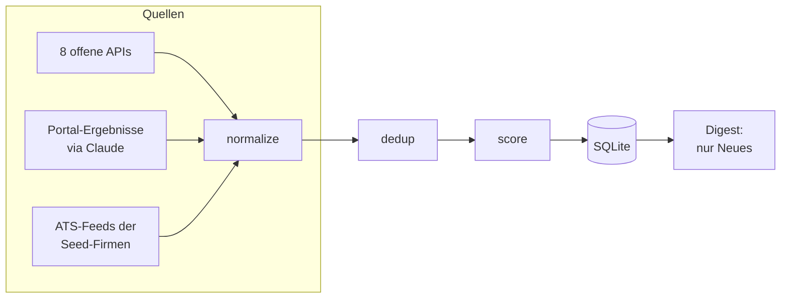

# jobsearch-skill

Ein lokales Werkzeug für die eigene Stellensuche. Ein Lauf fragt acht offene Job-APIs ab, liest die offenen Stellen-Feeds der Bewerbermanagementsysteme regionaler Firmen, nimmt Ergebnisse von Jobportalen entgegen, dedupliziert alles, bewertet es gegen ein Suchprofil und schreibt die neuen Treffer in einen datierten Markdown-Bericht. Gebaut, um Werkstudenten- und Junior-Stellen in Softwareentwicklung, Automatisierung und Internal Tools in der eigenen Region oder remote zu finden.

## Warum es das gibt

Stellensuche von Hand heißt, dieselben Portale immer wieder durchzuklicken, dieselben Anzeigen mehrfach zu sehen und den Teil des Markts zu verpassen, der nur auf Karriereseiten steht. Dieses Werkzeug macht daraus ein wiederholbares System. Es merkt sich in einer SQLite-Datenbank, was es schon gesehen hat, und meldet pro Lauf nur Neues. Die Anzeige für meine erste Bewerbung habe ich mit diesem Werkzeug gefunden.

## Arbeitsteilung: Python für das Planbare, Claude für das Unscharfe

Das Projekt ist als Claude-Code-Skill gebaut (`SKILL.md`). Die Trennlinie ist bewusst gezogen. Python macht alles Deterministische, also API-Abfragen, Parsen, Normalisieren, Deduplizieren, regelbasiertes Scoring, Zustand und Berichtsdatei. Jeder dieser Schritte ist testbar und läuft ohne LLM. Claude übernimmt das, was feste Regeln schlecht können: Jobportale ohne offene Schnittstelle auslesen, eine ergänzende Websuche fahren und die Treffer auf Relevanz beurteilen.

Das Kurationsprinzip heißt Recall vor Precision. Die Python-Filter sind absichtlich locker eingestellt, damit kein passender Treffer verloren geht. Claude benennt anschließend das Rauschen, löscht aber nichts, denn die Entscheidung bleibt beim Menschen.

## Pipeline



Die acht APIs sind Arbeitsagentur, Arbeitnow, Adzuna (die einzige mit API-Key), Himalayas, Jobicy, RemoteOK, Remotive und der LinkedIn-Gast-Endpunkt. Für Portale ohne API gibt es sechs Parser (StepStone, meinestadt, werkstudenten-jobs, Campusjäger, Absolventa, get-in-IT), die abgerufene Portalseiten in Jobs übersetzen. Fällt eine Quelle aus, läuft der Rest weiter, und der Bericht weist die fehlgeschlagenen Quellen aus.

Dedupliziert wird dreistufig. Erst eine URL-Kanonisierung, die Tracking-Parameter entfernt, dann ein sha1-Fingerprint aus Firma, Titel und Ort, bei dem Rechtsformen, Gender-Zusätze und Umlaut-Varianten normalisiert sind, zuletzt ein Fuzzy-Vergleich per rapidfuzz gegen die Kandidaten desselben Tages. Das Scoring ist regelbasiert und kostenlos. Muss-Kriterien filtern nach Beschäftigungsart, Tätigkeitsfeld und Ort oder Remote, Plus-Punkte ranken den Rest, etwa Technologie-Treffer, kleines Team oder der Hinweis „ohne Anschreiben". Das Profil dazu liegt in `config/profile.yaml`.

## Der verdeckte Markt: ATS-Feeds

Viele Stellen stehen nur auf Firmen-Karriereseiten. Allerdings laufen die meisten Karriereseiten auf einem gemieteten Bewerbermanagementsystem (ATS), und die haben offene, maschinenlesbare Feeds. `ats_detect.py` erkennt an einer Karriereseite, welches von acht ATS dahintersteckt (Personio, Greenhouse, Lever, Ashby, Recruitee, SmartRecruiters, Workday, Teamtailor), und `fetch_ats.py` liest die Feeds von sieben davon direkt, Personio als XML, die übrigen sechs als JSON. Teamtailor wird nur erkannt, weil es keinen sauberen Feed anbietet. Grundlage ist eine CSV-Liste regionaler Firmen. Meine eigene, von Hand recherchierte Liste ist nicht Teil dieses Repos, `data/companies_seed.example.csv` zeigt das Format mit drei öffentlichen Beispielen.

## Feedback-Schleife und Pflege

Der Bericht ist keine Endstation, sondern eine Arbeitsliste:

```
python scripts/mark.py <id> applied|rejected|interesting   # Status setzen
python scripts/mark.py list                                # bisherige Urteile ansehen
python scripts/rescore.py                                  # nach Profiländerung neu bewerten
python scripts/seed.py                                     # Firmenliste aus Verzeichnissen anreichern
python scripts/ats_detect.py                               # neue/migrierte ATS erkennen
```

Die Markierungen fließen in die nächste Kuration ein. Was abgelehnt wurde, wird leiser behandelt, was gefiel, hervorgehoben. Manuell gesetzte Status überleben jedes Neu-Scoring.

## Beispiel-Bericht

So sieht der Bericht eines Laufs aus, hier mit Beispieldaten:

```markdown
# Job-Digest 2026-08-11

Quellen: 7 ok, 1 fehlgeschlagen · **12 neu** · 134 gesamt in DB

## Werkstudent Softwareentwicklung (m/w/d)
**Beispielfirma GmbH** · Musterstadt · Score **55** · _arbeitnow_
3 Tech-Tags (+30); startup_or_small_team (+15); no_cover_letter_or_takehome (+10)
→ https://beispielfirma.example/jobs/werkstudent-softwareentwicklung

⚠ Fehlgeschlagene Quellen: adzuna
```

## Lokal starten

```
pip install -r requirements.txt
python scripts/run.py
```

Das reicht schon, denn ohne eigene Konfiguration nutzt das Werkzeug `config/profile.example.yaml` und überspringt Quellen, denen etwas fehlt, also Adzuna ohne Key und die ATS-Feeds ohne Firmenliste. Für die eigene Suche kopiert man `profile.example.yaml` nach `config/profile.yaml` und passt sie an, optional dazu `.env.example` nach `.env` für den Adzuna-Zugang und `data/companies_seed.example.csv` nach `data/companies_seed.csv`. Alle drei Dateien bleiben lokal, die `.gitignore` deckt sie ab. Der Bericht landet in `digests/`, der Zustand in `data/seen.sqlite`.

## Tests

```
python -m pytest tests/
```

129 Tests, alle ohne Netzzugriff, denn die Fetcher werden mit eingespielten Antworten getestet.

## Wie es gebaut wurde

Gebaut habe ich das Werkzeug mit Coding-Agenten. Der Entwurf und die Entscheidungen sind meine, den Code schreiben die Agenten. Der Bauplan liegt im Repo: `BUILD-START-HERE.md` mit Kontext, Phasen und Arbeitsregeln, `scripts/BUILD-MANIFEST.md` mit dem, was jedes Skript tun muss samt Testanforderung je Schritt, und `IMPLEMENTATION.md` mit den Architektur-Entscheidungen und den verifizierten Zugangswegen je Börse. Gebaut wurde in dieser Reihenfolge, testgetrieben und mit einem echten Lauf nach jedem Schritt.

## Status und Grenzen

Das Werkzeug läuft für meine eigene Stellensuche. Was es nicht kann:

- Die Arbeitsagentur-Quelle, die größte deutsche Stellendatenbank, antwortet mit Stand 11.08.2026 mit HTTP 403 auf allen dokumentierten Wegen. Ende Juli lief sie noch, die Ursache ist ungeklärt. Der Lauf weist sie als fehlgeschlagen aus.
- LinkedIn liefert über den Gast-Endpunkt nur Kurzdaten ohne Volltext, und der Endpunkt drosselt schnell, deshalb wird er absichtlich sparsam abgefragt.
- Ergebnisse und Profil sind auf eine konkrete Suche zugeschnitten, also Rollen, Technologien, Region oder remote. Für eine andere Suche passt man `profile.yaml` und die Firmenliste an.

## Lizenz

MIT, siehe `LICENSE`.
